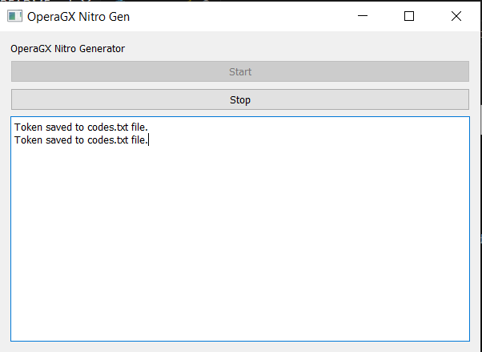

# OperaGX Nitro Generator




## How to use

1. **Install Python**
   - Make sure you have Python installed on your system.

2. **Open Console**
   - Open your command-line interface or terminal.

3. **Install Packages**
   - Run the following command to install the required packages:
     ```bash
     pip install requests
     pip install PyQt5
     ```

4. **Run the Script**
   - Execute the script using the following command:
     ```bash
     python app.py
     ```

5. **Star the Repo**
   - If it worked successfully, consider giving the repository a star! ✨💖
   - If you encounter any issues, please open an issue!

### Quick Run in the Cloud

[](https://replit.com/@RealOddPvP/OperaGX-Nitro-Generator?v=1)

No account needed, just click run!

## Stars 💖✨

[](https://star-history.com/#OddDevelopment/OperaGX-Nitro-Gen&Date)

Thanks for 35 stars! 💖

## Update Log

⭐ Works as of 12/25/2023


(Open an issue if you are having any issues)
